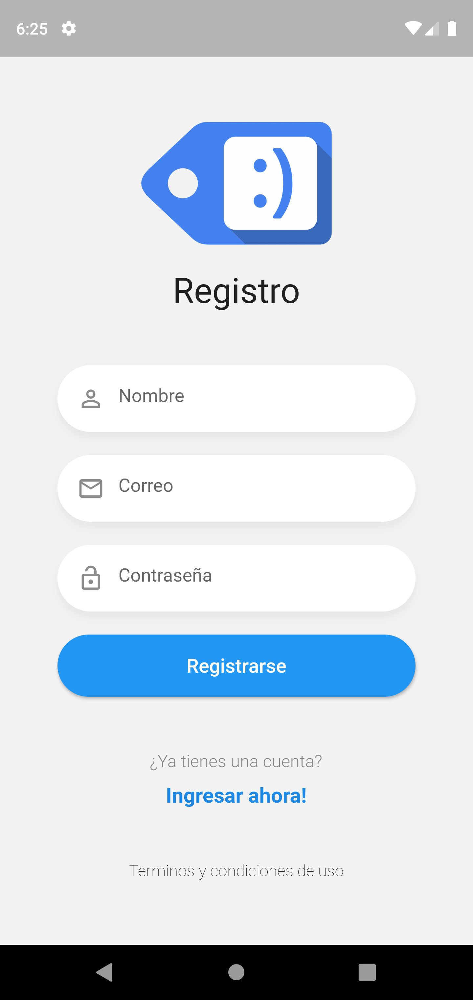
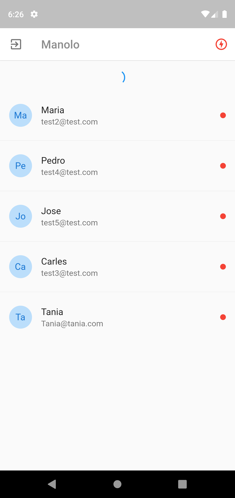
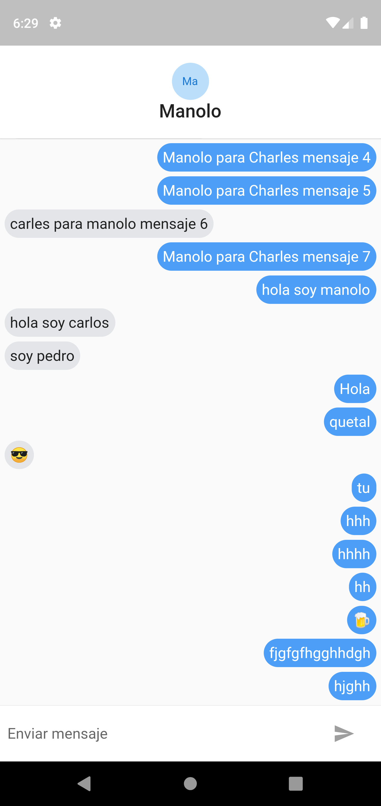

# Flutter App chat
## Esta aplicación esta creada con Flutter y un servidor Express

 

# Documentación
Este repo es una demo de una aplicación para comunicarse en tiempo real con otros dispositivos aplicando la tecnología de sockets,
para ello se respalda de un servido Node con Express